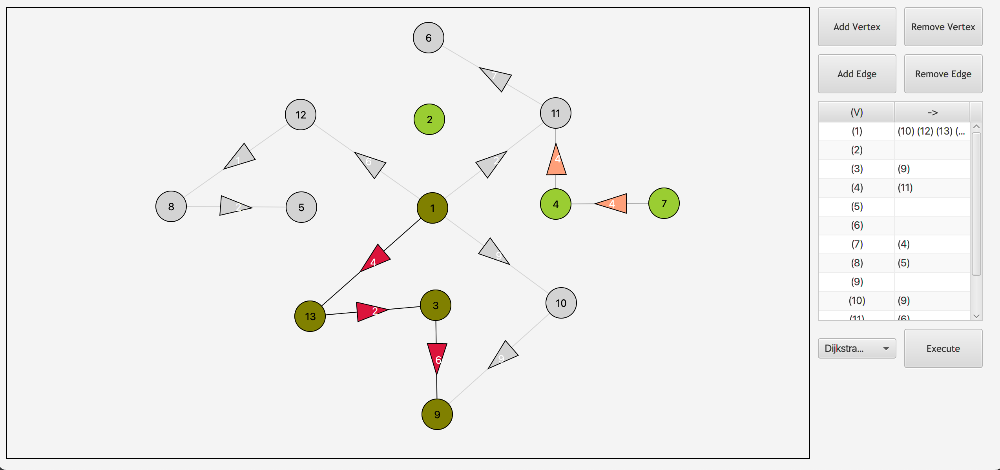

# Algviz


<!-- ABOUT THE PROJECT -->
## About The Project



A versatile GUI application that allows users to construct custom weighted directed graphs and observe various visualized algorithms. 

Features:
* Interactive board giving the user a high range of customizability of inserting vertices and connecting edges.
* Reciprocal matrix provided showing tabular representations of all vertices and their neighbors.
* Real-time visualization of Breadth-First Search, Depth-First Search, and Dijkstra's Shortest Path Algorithm.


### Created With

Here are the languages, tools, and frameworks used for the project.
* [Java](https://www.java.com/)
* [JavaFX](https://openjfx.io/)
* [Apache Maven](https://maven.apache.org/)
* [XML](https://www.w3.org/XML/)
* [CSS](https://www.w3.org/CSS/)


<!-- GETTING STARTED -->
## Getting Started

Few instructions on how to set up the configurations for this project.

### Installation

1. Install Apache Maven (& OpenJDK) binaries
   ```
   brew install mvn
   ```
2. Clone the repo
   ```
   git clone https://github.com/saadxan/AlgWiz.git
   ```
3. Compile & Run inside AlgWiz directory
   ```
   mvn compile
   ```
   ```
   mvn javafx:run
   ```


<!-- CONTRIBUTING -->
## Contributing

Contributions are integral to the open source community and are the reasons why it's so awesome. If you would like to contribute to this project, you can by: 

1. Fork the Project
2. Create a Feature Branch `git checkout -b new-feature`
3. Add files `git add .`
4. Commit Changes `git commit -m 'msg'`
5. Push to Origin `git push -u origin new-feature`
6. Open a Pull Request


<!-- LICENSE -->
## License

Distributed under the MIT License. See `LICENSE.txt` for more information.


<!-- ACKNOWLEDGEMENTS -->
## Acknowledgements

* [Example](https://www.example.com)
